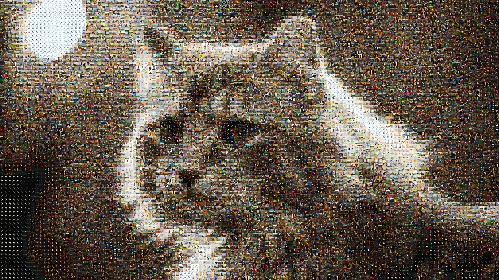

# Art through composition

From a set of images, recreating a source image into a composite image



## How to use it

1. Create a folder with a large number of images (at least 4000) that will allow the composition to be carried out.

2. Run the command :
```
python runme.py -s [your image] -f [images folder for the composition] --size 30
```
__Tips__ : The result is prettier if the source image is in high resolution. You can also change the parameter --size

## Libraries

You will need the next librairies :
- tqdm
- imageio
- numpy
- PIL

## Author
Raphael Teitgen (raphael.teitgen@gmail.com)